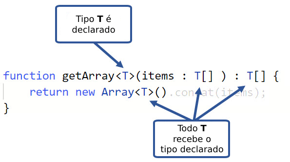

# Generics

Generics são templates que você pode definir para serem reutilizados durante seu codigo, podemos usa-los para declarar que tipo usar quando chamarmos classes, funções ou interfaces. Igualmente argumentos para um função. Mostaremos um exemplo a baixo para exemplificar

Criaremos uma função `getArray` para gerar arrays do tipo `Any`

```ts
function getArrays(items: any[]): any[] {
    return new Array().concat(items);
}


let numArray = getArray([1, 2, 3, 4, 5]);
let stringArray = getArray(["Pão", "Queijo", "Presunto"]);
```

Dessa forma podemos criar Arrays com qualquer tipo de elemento, porem ja que o tipo any esta sendo usado, podemos dar push em qualquer valor, por exemplo:

```ts
numArray.push(12);                             // OK
stringArray.push('Mortadela');                 // OK
numberArray.push('Isso não devia estar aqui'); // OK
stringArray.push(30);                          // OK
console.log(numberArray);                      // [5, 10, 15, 20, 12, "Isso não devia estar aqui"]
console.log(stringArray);                      // ["Pão", "Queijo", "Presunto", "Mortadela", 30]
```

Caso queira determinar o tipo de dados que o array ira receber para que o typeScript faça a checagem de tipos usamos os **Generics**, vamos reescrever a função acima para usar-los:

```ts
function getArray<T>(items: T[]): T[]{
    return new Array<T>().concat(items);
}
```

Generics podem ser usando para definir um mais de um tipo de variaveis para um componente, definimos os Generics usando `< >`, passando uma variavel de tipo, no nosso exemplo usamos `T`.


